---
## Front matter
title: "Лабораторная работа №2"
subtitle: "Архитектура вычислительных систем"
author: "Кулагина Анна Сергеевна"

## Generic otions
lang: ru-RU
toc-title: "Содержание"

## Bibliography
bibliography: bib/cite.bib
csl: pandoc/csl/gost-r-7-0-5-2008-numeric.csl

## Pdf output format
toc: true # Table of contents
toc-depth: 2
lof: true # List of figures
lot: true # List of tables
fontsize: 12pt
linestretch: 1.5
papersize: a4
documentclass: scrreprt
## I18n polyglossia
polyglossia-lang:
name: russian
options:
- spelling=modern
- babelshorthands=true
polyglossia-otherlangs:
name: english
## I18n babel
babel-lang: russian
babel-otherlangs: english
## Fonts
mainfont: PT Serif
romanfont: PT Serif
sansfont: PT Sans
monofont: PT Mono
mainfontoptions: Ligatures=TeX
romanfontoptions: Ligatures=TeX
sansfontoptions: Ligatures=TeX,Scale=MatchLowercase
monofontoptions: Scale=MatchLowercase,Scale=0.9
## Biblatex
biblatex: true
biblio-style: "gost-numeric"
biblatexoptions:
- parentracker=true
- backend=biber
- hyperref=auto
- language=auto
- autolang=other*
- citestyle=gost-numeric
## Pandoc-crossref LaTeX customization
figureTitle: "Рис."
tableTitle: "Таблица"
listingTitle: "Листинг"
lofTitle: "Список иллюстраций"
lotTitle: "Список таблиц"
lolTitle: "Листинги"
## Misc options
indent: true
header-includes:
- \usepackage{indentfirst}
- \usepackage{float} # keep figures where there are in the text
- \floatplacement{figure}{H} # keep figures where there are in the text
---

# Цель работы
Изучить идеологию и применение средств контроля версий и приобрести практические навыки по работе с системой git.
# Задание

1. Создайте отчет по выполнению лабораторной работы в соответствующем
каталоге рабочего пространства (labs>lab03>report).
2. Скопируйте отчеты по выполнению предыдущих лабораторных работ в
соответствующие каталоги созданного рабочего пространства.
3. Загрузите файлы на github.

# Теоретическое введение

Здесь описываются теоретические аспекты, связанные с выполнением работы.

Например, в табл. [-@tbl:std-dir] приведено краткое описание стандартных каталогов Unix.

: Описание некоторых каталогов файловой системы GNU Linux {#tbl:std-dir}

| Имя каталога | Описание каталога |
|--------------|----------------------------------------------------------------------------------------------------------------------------|
| `/` | Корневая директория, содержащая всю файловую |
| `/bin ` | Основные системные утилиты, необходимые как в однопользовательском режиме, так и при обычной работе всем пользователям |
| `/etc` | Общесистемные конфигурационные файлы и файлы конфигурации установленных программ |
| `/home` | Содержит домашние директории пользователей, которые, в свою очередь, содержат персональные настройки и данные пользователя |
| `/media` | Точки монтирования для сменных носителей |
| `/root` | Домашняя директория пользователя `root` |
| `/tmp` | Временные файлы |
| `/usr` | Вторичная иерархия для данных пользователя |

Более подробно об Unix см. в [@gnu-doc:bash;@newham:2005:bash;@zarrelli:2017:bash;@robbins:2013:bash;@tannenbaum:arch-pc:ru;@tannenbaum:modern-os:ru].

# Выполнение лабораторной работы

Описываются проведённые действия, в качестве иллюстрации даётся ссылка на иллюстрацию (рис. [-@fig:001])
      1) Создаем учетную запись на Github , сделаем конфигурацию git. Откроем терминал и введем команды,  указав имя и email владельца репозитория. Настроим utf-8, зададим имя начальной ветки (master), параметры autocrlf и safecrlf.
    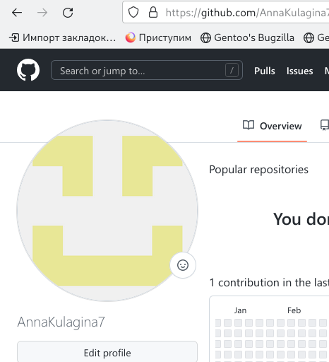{ #fig:001 width=90% }
    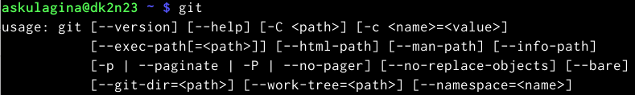{ #fig:001 width=90 }
    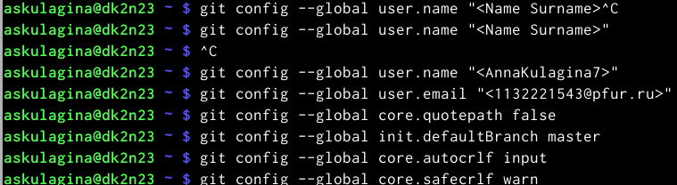{ #fig:001 width=90%}
Описываются проведённые действия, в качестве иллюстрации даётся ссылка на иллюстрацию (рис. [-@fig:002])
     
      2)Генерируем ключи, сохраняя в каталоге ~/.ssh/ , загрузим сгенерированный открытый ключ, вставляем ключ в появившееся поле и указываем для него имя (Title).
    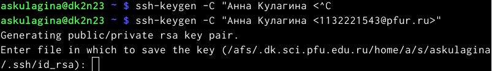{ #fig:002 width=90% }
    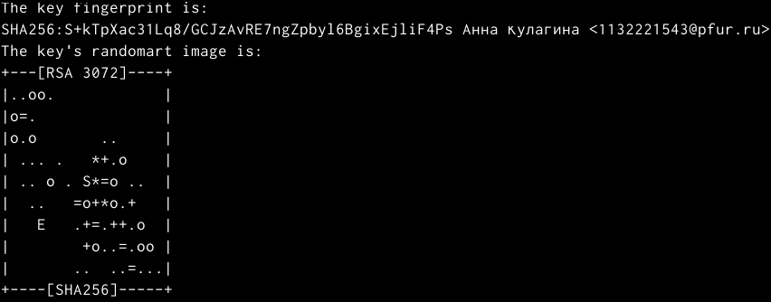{ #fig:002 width=90% }
    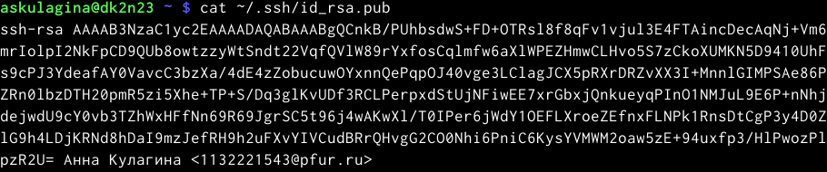{ #fig:002 width=90% }
    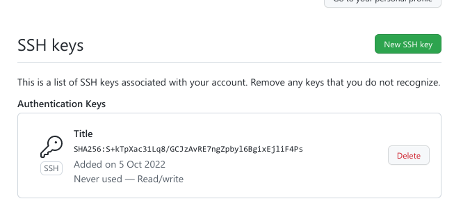{ #fig:002 width=90% }
    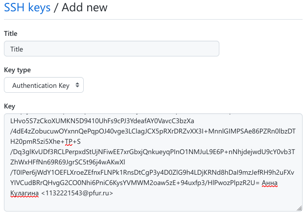{ #fig:002 width=90% }

    Описываются проведённые действия, в качестве иллюстрации даётся ссылка на иллюстрацию (рис. [-@fig:003])
     
     3)Снова откроем терминал и создадим каталог для предмета «Архитектура компьютера»,затем перейдем в каталог курса, клонируем созданный репозиторий.
    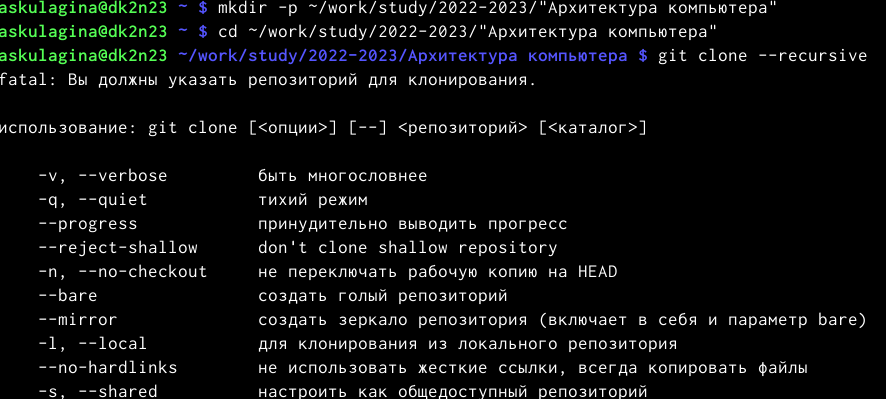{ #fig:003 width=90% }
    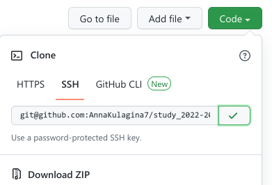{ #fig:003 width=90% }
     
     Описываются проведённые действия, в качестве иллюстрации даётся ссылка на иллюстрацию (рис. [-@fig:004])
    
     4)Перейдем в каталог курса ,удалим лишние файлы ,создадим необходимые нам каталоги, отправим файлы на сервер .проверим правильность в локальном репозитории и на странице github.
    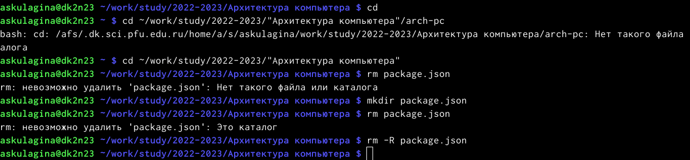{ #fig:004width=90% }
    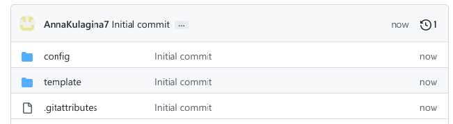{ #fig:004width=90%}
    { #fig:004width=90%}
    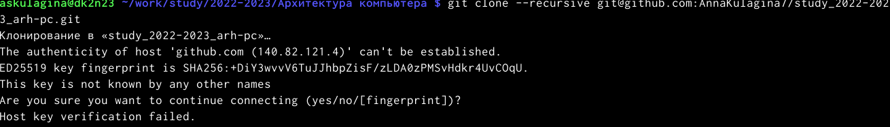{ #fig:004width=90% }
    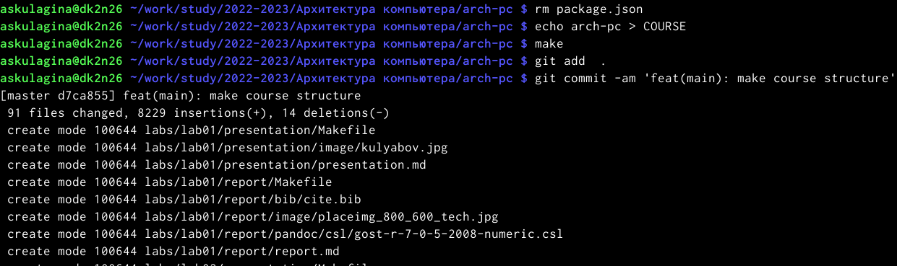{ #fig:004width=90% }
    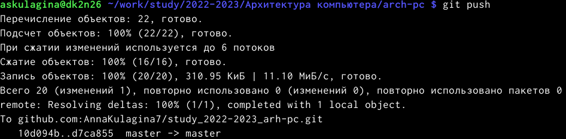{ #fig:004width=90% }
    
     Описываются проведённые действия, в качестве иллюстрации даётся ссылка на иллюстрацию (рис. [-@fig:005])
   
    5)Проверим правильность в локальном репозитории и на странице github.
    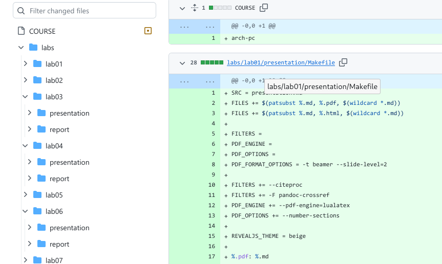{ #fig:004width=90% }
   
    Ход самостоятельной работы :
    1. Создадим отчет по выполнению лабораторной работы в каталоге рабочего пространства (labs>lab03>report).
    2. Скопируем отчеты по выполнению предыдущих лабораторных работ в соответствующие каталоги созданного рабочего пространства.
    3. Загрузим файлы на github.
    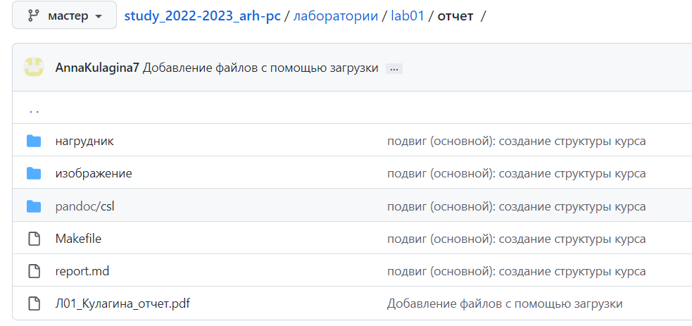{ #fig:004width=90%}
    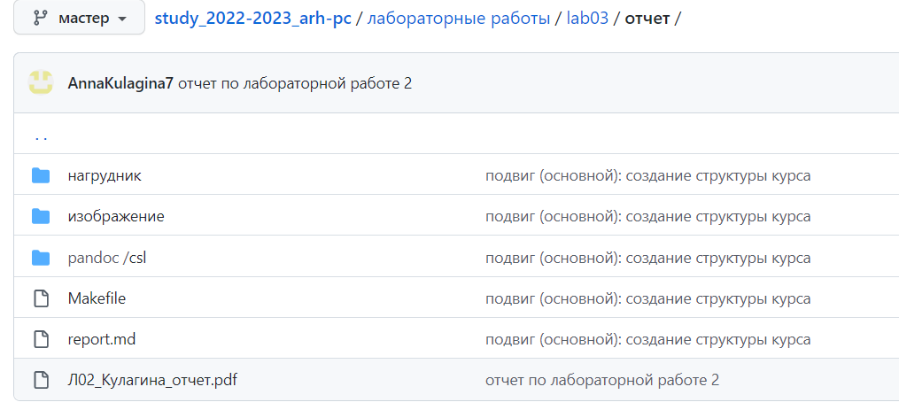{ #fig:004width=90% }
    # Выводы
    В ходе выполнения данной лабораторной работы я приобрела практические навыки общения с системой git,а также изучила идеологию и применение средств.
    # Список литературы{.unnumbered}

    ::: {#refs}
    :::

