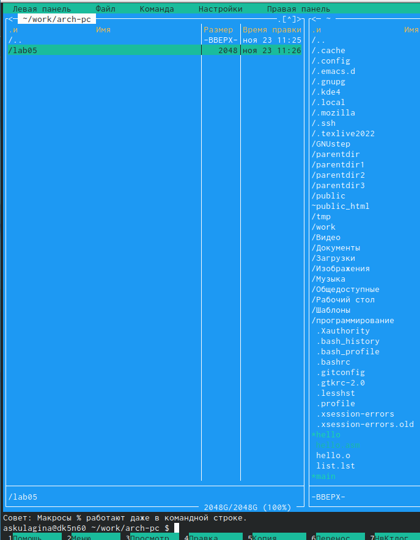
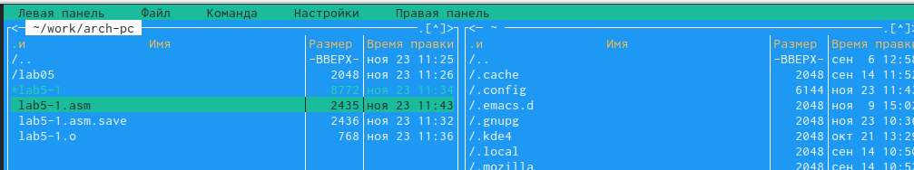
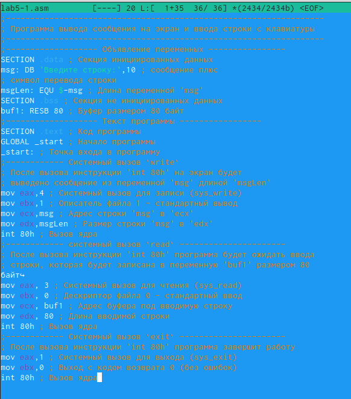
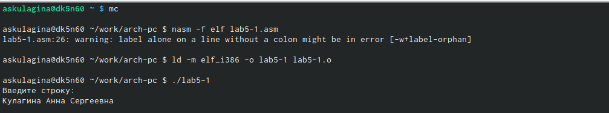
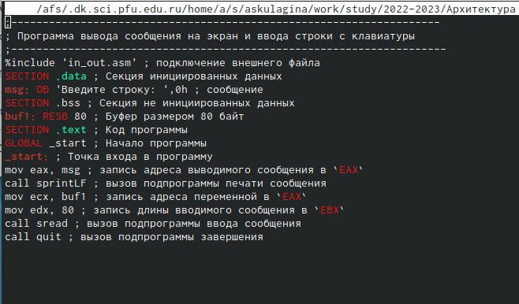
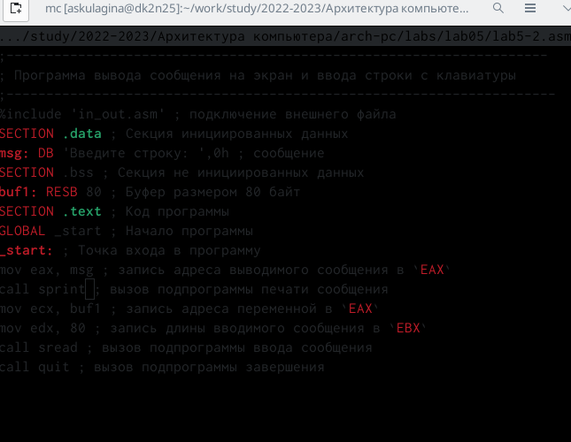

---
## Front matter
title: "Отчет 
по лабораторной работе № 5"
subtitle: "Архитектура вычислительных систем"
author: "Кулагина Анна Сергеевна"

## Generic otions
lang: ru-RU
toc-title: "Содержание"

## Bibliography
bibliography: bib/cite.bib
csl: pandoc/csl/gost-r-7-0-5-2008-numeric.csl

## Pdf output format
toc: true # Table of contents
toc-depth: 2
lof: true # List of figures
lot: true # List of tables
fontsize: 12pt
linestretch: 1.5
papersize: a4
documentclass: scrreprt
## I18n polyglossia
polyglossia-lang:
  name: russian
  options:
	- spelling=modern
	- babelshorthands=true
polyglossia-otherlangs:
  name: english
## I18n babel
babel-lang: russian
babel-otherlangs: english
## Fonts
mainfont: PT Serif
romanfont: PT Serif
sansfont: PT Sans
monofont: PT Mono
mainfontoptions: Ligatures=TeX
romanfontoptions: Ligatures=TeX
sansfontoptions: Ligatures=TeX,Scale=MatchLowercase
monofontoptions: Scale=MatchLowercase,Scale=0.9
## Biblatex
biblatex: true
biblio-style: "gost-numeric"
biblatexoptions:
  - parentracker=true
  - backend=biber
  - hyperref=auto
  - language=auto
  - autolang=other*
  - citestyle=gost-numeric
## Pandoc-crossref LaTeX customization
figureTitle: "Рис."
tableTitle: "Таблица"
listingTitle: "Листинг"
lofTitle: "Список иллюстраций"
lotTitle: "Список таблиц"
lolTitle: "Листинги"
## Misc options
indent: true
header-includes:
  - \usepackage{indentfirst}
  - \usepackage{float} # keep figures where there are in the text
  - \floatplacement{figure}{H} # keep figures where there are in the text
---

# Цель работы

Приобретение практических навыков работы в Midnight Commander. Освоение инструкций языка ассемблера mov и int.

# Задание
1. Создайте копию файла lab5-1.asm. Внесите изменения в программу (без
использования внешнего файла in_out.asm), так чтобы она работала по
следующему алгоритму:
• вывести приглашение типа “Введите строку:”;
• ввести строку с клавиатуры;
• вывести введённую строку на экран.
2. Получите исполняемый файл и проверьте его работу. На приглашение
ввести строку введите свою фамилию.
3. Создайте копию файла lab5-2.asm. Исправьте текст программы с исполь-
зование подпрограмм из внешнего файла in_out.asm, так чтобы она ра-
ботала по следующему алгоритму:
• вывести приглашение типа “Введите строку:”;
• ввести строку с клавиатуры;
• вывести введённую строку на экран.

# Выполнение лабораторной работы

Описываются проведённые действия, в качестве иллюстрации даётся ссылка на иллюстрацию (рис. [-@fig:001])
1)Откроем Midnight Commander,пользуясь клавишами ↑ , ↓ и Enter перейдем в каталог ~/work/arch- pc ,созданный при выполнении лабораторной работы No4.С помощью функциональной клавиши F7 создадим папку lab05 и перейдем в него.

{ #fig:001 width=95% }

Описываются проведённые действия, в качестве иллюстрации даётся ссылка на иллюстрацию (рис. [-@fig:002])

2) С помощью функциональной клавиши F4 откроем файл lab5-1.asm для редактирования во встроенном редакторе.В качестве встро-
енного редактора Midnight Commander используется редакторы nano или mcedit.Введем  текст программы из листинга сохраним изменения и закроем файл.С помощью функциональной клавиши F3 откроем файл lab5-1.asm для
просмотра. Убедимся, что файл содержит текст программы.
{ #fig:002 width=95% }
{ #fig:003 width=95% }

Описываются проведённые действия, в качестве иллюстрации даётся ссылка на иллюстрацию (рис. [-@fig:003])

3) Оттранслируем текст программы lab5-1.asm в объектный файл. Выполним компоновку объектного файла и запустим получившийся исполняемый
файл. На запрос введем наше ФИО.

Описываются проведённые действия, в качестве иллюстрации даётся ссылка на иллюстрацию (рис. [-@fig:004])

{ #fig:004 width=95% }

Описываются проведённые действия, в качестве иллюстрации даётся ссылка на иллюстрацию (рис. [-@fig:005])

4)Для вызова подпрограммы
из внешнего файла используем call <function>.Скачаем файл in_out.asm со страницы курса в ТУИС.В одной из панелей mc откроем каталог с файлом lab5-1.asm. В другой панели каталог со скаченным файлом in_out.asm (для перемещения между панелями
используем Tab ). Скопируем файл in_out.asm в каталог с файлом lab5-1.asm
с помощью функциональной клавиши F5.С помощью функциональной клавиши F6 создадим копию файла lab5-1.asm с именем lab5-2.asm. Выделим файл lab5-1.asm, нажмем клавишу F6 , введем имя файла lab5-2.asm и нажмем клавишу Enter.

{ #fig:005 width=95% }

Описываются проведённые действия, в качестве иллюстрации даётся ссылка на иллюстрацию (рис. [-@fig:006])

 5)В файле lab5-2.asm заменим подпрограмму sprintLF на sprint. Создадим исполняемый файл и проверим его работу. Разница в том,что текст выводится на той же строке,где расположена фраза "Введите строку",а не на отдельной.
 { #fig:005 width=95% }
 
 
 
 Ход выполнения самостоятельной работы:
1) Создадим копию файла lab5-1.asm. Внесем изменения в программу (без
использования внешнего файла in_out.asm).
2) Получим исполняемый файл и проверим его работу. На приглашение
введем строку введите свою фамилию.
3) Создадим копию файла lab6-2.asm. Исправим текст программы с исполь-
зование подпрограмм из внешнего файла in_out.asm, так чтобы она ра-
ботала по следующему алгоритму:
• выведем приглашение типа “Введите строку:”;
• введем строку с клавиатуры;
• выведем введённую строку на экран.
4) Создадим исполняемый файл и проверим его работу.

# Выводы

 Я приобрела практические навыки работы с редакторами nano и gedit. А также познакомился с Midnight Commander.

# Список литературы{.unnumbered}

::: {#refs}
:::
